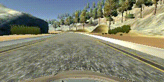
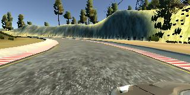
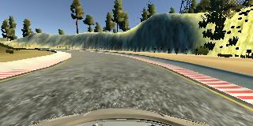
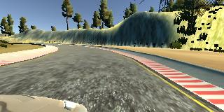
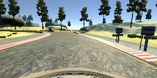

# Behavioral Cloning Project

[](http://www.udacity.com/drive)

This repository contains my implementation for the Behavioral Cloning Project of Udacity Self-Driving Car NanoDegree. Project instructions can be found [here](https://github.com/udacity/CarND-Behavioral-Cloning-P3).

In this project, a deep neural network was trained to clone driving behaviors and drive autonomously a car in the Udacity Simulator. The model was trained, validated and tested using Keras. The model outputs a steering angle to an autonomous vehicle.

Udacity has provided a simulator where you can steer a car around a track for data collection. You'll use image data and steering angles were used to train a neural network and then use this model to drive the car autonomously around the track.

This project contains the following files:

- `model.py`            : Script used to create and train the model
- `drive.py`            : Script to drive the car in the Udacity simulator
- `model.h5`            : The trained Keras model
- `writeup_report.md`   : A report writeup file 
- `video.mp4`           : The video recording the vehicle driving autonomously around the track for one full lap

The goals / steps of this project are the following:

- Use the simulator to collect data of good driving behavior 
- Design, train and validate a model that predicts a steering angle from image data
- Use the model to drive the vehicle autonomously around the first track in the simulator. The vehicle should remain on the road for an entire loop around the track.
- Summarize the results with a written report

# Dependencies 

This project was built and was run on Ubuntu 18.04.5 LTS. An Anaconda (Conda) environmet was used to help match the required package versions to run the same code in the Udacity workspace and along with the Udacity Simulator. 

To help setting up the environment and packages, `conda_requirements.txt` and `pip_requirements.txt` were provided.

The base dependencies/packages are required:
- Anaconda 4.10.1
- [Udacity's Self-Driving Car Simulator](https://github.com/udacity/self-driving-car-sim) - Term 1, Version 2 Linux

# Installation

Clone this repository in the desired folder on your computer. Consider all commands shown bellow are run in this folder when not specified.

```
cd ~/your_desired_folder
git clone https://github.com/rodriguesrenato/CarND-Behavioral-Cloning-P3.git
```
Create a new conda environment from `conda_requirements.txt` file:

```
conda create --name car-nd-p3 --file conda_requirements.txt
```

Activate your conda environment:

```
conda activate car-nd-p3
```

Install all required packages through pip:

```
pip install -r pip_requirements.txt 
```

NOTE: If you got problems configuring and installing the environment/packages, follow the instructions provided by Udacity [here](https://github.com/udacity/CarND-Term1-Starter-Kit/blob/master/doc/configure_via_anaconda.md).

To install the Udacity Simulator, simply download the `Term 1 -> Version 2 -> Linux` [here](https://github.com/udacity/self-driving-car-sim), unzip the `beta_simulator_linux` in this project folder, make `beta_simulator.x86_64` executable (`chmod +x beta_simulator.x86_64`, if your system is 64 bits).

# Usage

## Simulator

To launch the Simulator:

```
conda activate car-nd-p3
./beta_simulator_linux/beta_simulator.x86_64
```

When you open for the first time, you will have to select Screen Resolution of 640 x 480 and Graphics Quality as Fastest. 

After the simulator fully initialized, you can choose between `training mode` and `autonomouse mode`. In `training mode` you can drive the car on the selected track in the menu and record driving data. In `autonomous mode`, you have to have `drive.py` running to drive the car autonomously on the road.

## Autonomous driving with `drive.py`

Usage of `drive.py` requires you have saved the trained model as an h5 file, i.e. `model.h5`. It can be used with drive.py using this command:

```sh
python drive.py model.h5
```

The above command will load the trained model and use the model to make predictions on individual images in real-time and send the predicted angle back to the server via a websocket connection.

Note: There is known local system's setting issue with replacing "," with "." when using drive.py. When this happens it can make predicted steering values clipped to max/min values. If this occurs, a known fix for this is to add "export LANG=en_US.utf8" to the bashrc file.

### Saving a video of the autonomous agent

```sh
python drive.py model.h5 run1
```

The fourth argument, `run1`, is the directory in which to save the images seen by the agent. If the directory already exists, it'll be overwritten.

```sh
ls run1

[2017-01-09 16:10:23 EST]  12KiB 2017_01_09_21_10_23_424.jpg
[2017-01-09 16:10:23 EST]  12KiB 2017_01_09_21_10_23_451.jpg
[2017-01-09 16:10:23 EST]  12KiB 2017_01_09_21_10_23_477.jpg
[2017-01-09 16:10:23 EST]  12KiB 2017_01_09_21_10_23_528.jpg
[2017-01-09 16:10:23 EST]  12KiB 2017_01_09_21_10_23_573.jpg
[2017-01-09 16:10:23 EST]  12KiB 2017_01_09_21_10_23_618.jpg
[2017-01-09 16:10:23 EST]  12KiB 2017_01_09_21_10_23_697.jpg
[2017-01-09 16:10:23 EST]  12KiB 2017_01_09_21_10_23_723.jpg
[2017-01-09 16:10:23 EST]  12KiB 2017_01_09_21_10_23_749.jpg
[2017-01-09 16:10:23 EST]  12KiB 2017_01_09_21_10_23_817.jpg
...
```

The image file name is a timestamp of when the image was seen. This information is used by `video.py` to create a chronological video of the agent driving.

### Create a video of the saved autonomous driving with `video.py`

```sh
python video.py run1
```

Creates a video based on images found in the `run1` directory. The name of the video will be the name of the directory followed by `'.mp4'`, so, in this case the video will be `run1.mp4`.

Optionally, one can specify the FPS (frames per second) of the video:

```sh
python video.py run1 --fps 48
```

Will run the video at 48 FPS. The default FPS is 60.

# Model Architecture and Training

## Solution Design Approach

The overall strategy for deriving a model architecture was to start with a simple model (only a 100 Dense layer) to do a full test of autonomous driving in the Simulator, and after that, start testing more complex models. 

Before started designing models, I collected more samples to get a better dataset, as explained in the next sections. To expand the dataset, the 3 given images per sample and the augmented version (image/measurement flipped) of them were used. I built a summary of the dataset to check if the samples are too biased and well distributed.

Then, I have implemented and tested a model similar to LeNet-5 architecture, with 3 convolutional layers and but with poor testing results on the simulator. I thought this model might be appropriate because 3 convolutional layers would be able to detect enough higher level features to continue through the dense layers.

After that, I decided to implement a new model based on the model published by the [autonomous vehicle team at NVIDIA](https://developer.nvidia.com/blog/deep-learning-self-driving-cars/). This a more complex model, with 5 convolutional layers, which will be able to detect even higher level features, followed by 4 dense layers. This model worked pretty well and the car succeed to drive autonomously.

In order to gauge how well the model was working, I split my image and steering angle data into a training and validation set with a proportion of 80% and 20% respectively. I found that my first model had a low mean squared error on the training set but a high mean squared error on the validation set. This implied that the model was overfitting. 

To combat the overfitting, I tried to apply regularization by adding Dropout layers between the dense layers. I tried multiple configurations and rates. The configuration that worked the best was only one dropout layer between the two last dense layers, with a lower rate of 0.2.
 
The final step was to run the simulator to see how well the car was driving around track one. With the first designed models, the car the vehicle fell off the track and wasn't able to recover when it gets off the center of the lane. To improve the driving behavior in these cases, I have recorded a full lap driving sinusoidally on the center of the road, which improves the model in the following trainings.

At the end of the process, the vehicle is able to drive autonomously around the track without leaving the road.

## Final Model Architecture

The final model architecture (model.py lines 18-24) are described in the table below:

| Layer (type)              | Description | Output Shape          | Param #|
|---------------------------|-------------|-----------------------|--------|
| lambda_5 (Lambda)         | Image Normalization  | (None, 160, 320, 3)   | 0      |
| cropping2d_5 (Cropping2D) | Image Cropping on ROI | (None, 65, 320, 3)    | 0      |
| conv2d_21 (Conv2D)        | Convolutional 5x5 filter, 2x2 stride, ReLu activation and 24 output filters  | (None, 31, 158, 24)   | 1824   |
| conv2d_22 (Conv2D)        | Convolutional 5x5 filter, 2x2 stride, ReLu activation and 36 output filters | (None, 14, 77, 36)    | 21636  |
| conv2d_23 (Conv2D)        | Convolutional 5x5 filter, 2x2 stride, ReLu activation and 48 output filters | (None, 5, 37, 48)     | 43248  |
| conv2d_24 (Conv2D)        | Convolutional 3x3 filter, 1x1 stride, ReLu activation and 64 output filters | (None, 3, 35, 64)     | 27712  |
| conv2d_25 (Conv2D)        | Convolutional 3x3 filter, 1x1 stride, ReLu activation and 64 output filters | (None, 1, 33, 64)     | 36928  |
| flatten_5 (Flatten)       | Flatten last convolutional output | (None, 2112)          | 0      |
| dense_17 (Dense)          | Fully connected with size 100, ReLu activation | (None, 100)           | 211300 |
| dense_18 (Dense)          | Fully connected with size 50, ReLu activation | (None, 50)            | 5050   |
| dense_19 (Dense)          | Fully connected with size 20, ReLu activation | (None, 20)            | 1020    |
| dropout_21 (Dropout)      | Regularization Dropout of 0.2 | (None, 20)            | 0    |
| dense_20 (Dense)          | Output layer - predicted steering angle | (None, 1)             | 11     |

Parameters statistics:
- Total params: 348,219
- Trainable params: 348,219
- Non-trainable params: 0

My model chosen consists of a sequence of 5 convolutional neural network layers, followd by 4 fully connected layers. The first 3 convolutional layers have 5x5 filter sizes, 2x2 strides sizes and depths of 24, 36 and 48. The next 2 convolutional layers have 3x3 filter sizes and depth of 64. The following 4 fully connected layers have sizes of 100, 50, 20 and 1, as the last layer is the output layer. A dropout layer was added between the last two dense layers. (model.py lines 18-24 TODO) 

Each layer in the model includes RELU to introduce nonlinearity, except the output layer, and the data is normalized from -0.5 to 0.5 in the model using a Keras lambda layer (code line 18 TODO). 

Here is a visualization of the architecture generated by keras util `plot_model`:


## Creation of the Training Set & Training Process

To capture good driving behavior, I first recorded two laps on track one. On the first lap, I drive the vehicle close as possible to the center lane. Here is an example image of center lane driving:


On the second lap, I recorded the vehicle recovering from the left side and right sides of the road back to center so that the vehicle would learn how to get back to the center of road. This gif image shows what a recovery looks like starting from center and getting back to center:



After the collection process, there are 2850 data points (samples). This samples dataset is randomly shuffled and split in 80% for the `train_samples` set and 20% for the `validation_samples` set

I decided to use the 3 images from the Center, Left and Right camera of each sample. I added a `steering_correction` value to the steering angle of each corresponding image, except for the Center image that this correction value is `0`. The side cameras images could be interpreted as the central image of a car that isn't in the center of the lane, so that is why I need to add a correction value to stimulate the car drive back to the center when it gets on that position. These are an example of the Left, Center and Right camera output for the same sample set.

| Left | Center | Right |
|------|--------|-------|
| |  | |
| steering_correction = 0.2 | steering_correction = 0 | steering_correction = -0.2 |

To augment the dataset, I also flipped images and angles thinking that this would duplicate the dataset, add more data of right turns to help model don't bias to left and the result would be resonable, the same as if we have recoded this driving on a horizontally flipped track. For example, here is an image that has then been flipped:

| Normal | Augmented (Flipped) |
|------|--------|
| |  |

At this point, each sample data will generate 6 images/measurements, resulting in a trainig dataset with size of `13680` and validation dataset with size of `3420`.

Here is the summary of the dataset used in the training:

```py
#Dataset Summary (considering center, left, and right images, all of them with an augmented version

Total train samples   = 13680
   | Distribuition (Center,Left,Right) = (0.24,0.43,0.33)
   | Min/Max Steering (Left,Right) = (-1.20,1.20)
Total validation samples = 3420
   | Distribuition (Center,Left,Right) = (0.25,0.41,0.34)
   | Min/Max Steering (Left,Right) = (-1.15,1.20)
```

This dataset expansion process is done directly in the generator function, which is responsible to read and process the images/measurements values, returning them in batches. Using a generator to load and process the images/measurements in training data in batches, it avoids the program to use a high amount of memory at once.

The images are pre processed directly in the Keras sequential model. The images are normalized from -0.5 to 0.5 through a lambda function and then cropped from top and bottom through Keras Cropping2D function to crop image on the lane area.

I used this training data for training the model. The validation set helped determine if the model was over or under fitting. The ideal number of epochs was `8` as evidenced by the following graph, showing that at this point both curves gets closer and stable between epochs.


I used an adam optimizer so that manually training the learning rate wasn't necessary.
