# **Behavioral Cloning**

---

## Writeup

**Behavioral Cloning Project**

The goals / steps of this project are the following:
* Use the simulator to collect data of good driving behavior
* Build, a convolution neural network in Keras that predicts steering angles from images
* Train and validate the model with a training and validation set
* Test that the model successfully drives around track one without leaving the road
* Summarize the results with a written report

---

## Rubric Points

Here I will consider the [rubric points](https://review.udacity.com/#!/rubrics/432/view) individually and describe how I addressed each point in my implementation.  

---
## Files Submitted & Code Quality

> 1 . Submission includes all required files and can be used to run the simulator in autonomous mode

My project includes the following files:
* model.py 
  * containing the script to create and train the model
* drive.py 
  * for driving the car in autonomous mode
* model.h5 
  * containing a trained convolutional neural network 
* writeup_report.md 
  * summarizing the results

> 2 . Submission includes functional code

Using the Udacity provided simulator and my drive.py file, the car can be driven autonomously around the track by executing 
```sh
python drive.py model.h5
```

> 3 . Submission code is usable and readable

The model.py file contains the code for training and saving the convolution neural network. The file shows the pipeline I used for preprocessing, training and validating the model, and it contains comments to explain how the code works.

There is also a jupyter notebook that has the same code, which makes it easier to iterate through results and make new tests. It has some graph visualization of the results.

---

## Model Architecture and Training Strategy

> 1 . An appropriate model architecture has been employed

The model architecture chosen is based on the model published by the [autonomous vehicle team at NVIDIA](https://developer.nvidia.com/blog/deep-learning-self-driving-cars/), as shown in class, which gave the best results. I have tried LeNet architecture variations before without any considerable success. 

> 2 . Attempts to reduce overfitting in the model

The model architecture without dropout layers achieved good test results on the simulator, but it has some overfitting.

On the other hand, adding a ReLu activation followed by dropout regularization layer right before the output layer, it decreases even more the mse loss and reduces overfitting. (model.py line 140). 

The model was trained and validated on different data sets by splitting the training dataset on 80% for training and 20% for validation, to ensure that the model was not overfitting (code line 10-16). The model was tested by running it through the simulator and ensuring that the vehicle could stay on the track.

> 3 . Model parameter tuning

The model used an adam optimizer, so the learning rate was not tuned manually (model.py line 25).

The convolutional layer parameters and dense layer sizes achieved good results. I tried other dense layers sizes, but then I chose the one which performed the best.

ReLu activation decreased both training and validation loss.

The dropout layer were tested with different configurations and rates. It performed better between the last two dense layers and with a rate of 0.2. Higher rates have increased the overfitting.

> 4 . Appropriate training data

Training data was chosen to keep the vehicle driving on the road. I used a combination of one lap of center lane driving and one lap of sinusoidal driving from the center to left and right sides of the road, simulating a recovery maneuver to get back to the center of the road.

In addition to build the final dataset, the Center, Left and Right camera images were used and their respective augmented version (image flipped horizontally and negative the steering angle), which increases the training dataset **six** times. The final size of the sample dataset is 31158 images/measurements, which will be split 80% for training and 20% for validating.

For details about how I created the training data, see the next section. 

---

## Model Architecture and Training Documentation

This section is explained directly in the `README.md` file, on the `Model Architecture and Training` section. The following text are a copy from `README.md`

> 1 . Solution Design Approach

The overall strategy for deriving a model architecture was to start with a simple model (only a 100 Dense layer) to do a full test of autonomous driving in the Simulator, and after that, start testing more complex models. 

Before starting designing models, I collected more samples to get a better dataset, as explained in the next sections. To expand the dataset, the 3 given images per sample and the augmented version (image/measurement flipped) of them were used. I built a summary of the dataset to check if the samples are biased and well distributed.

Then, I have implemented and tested a model similar to LeNet-5 architecture, with 3 convolutional layers and two dense layers. This model performed poorly on the simulator. I thought this model might be appropriate because 3 convolutional layers would be able to detect enough higher level features to continue through the dense layers.

After that, I decided to implement a new model based on the model published by the [autonomous vehicle team at NVIDIA](https://developer.nvidia.com/blog/deep-learning-self-driving-cars/). This is a more complex model, with 5 convolutional layers, which will be able to detect even higher level features, followed by 4 dense layers. This model worked pretty well and the car succeeded in driving autonomously.

In order to gauge how well the model was working, I split my image and steering angle data into a training and validation dataset with a proportion of 80% and 20% respectively. I found that the current model had a low mean squared error on the training set but a high mean squared error on the validation set. This implied that the model was overfitting. 

To combat the overfitting, I tried to apply regularization by adding Dropout layers between the dense layers. I tried multiple configurations and rates. The configuration that worked the best was only one dropout layer between the two last dense layers, with a lower rate of 0.2.
 
The final step was to run the simulator to see how well the car was driving around track one. With the first designed models, the vehicle fell off the track and wasn't able to recover when it got off the center of the lane. With the model based on LeNeT, the car couldn't recover from sharp turns. The final model, the one based on the NVIDIA model, worked well, the car could recover when it got off the center and drive through the whole lap without getting off the road.

To improve the driving behavior in these cases, I have recorded a new full lap driving sinusoidally on the center of the road, which improves the model in the following training sessions.

At the end of the process, the vehicle is able to drive autonomously around the track without leaving the road.

> 2 . Final Model Architecture

The final model architecture (model.py lines 112-141) are described in the table below:

| Layer (type)              | Description | Output Shape          | Param #|
|---------------------------|-------------|-----------------------|--------|
| lambda_5 (Lambda)         | Image Normalization  | (None, 160, 320, 3)   | 0      |
| cropping2d_5 (Cropping2D) | Image Cropping on ROI | (None, 65, 320, 3)    | 0      |
| conv2d_21 (Conv2D)        | Convolutional 5x5 filter, 2x2 stride, ReLu activation and 24 output filters  | (None, 31, 158, 24)   | 1824   |
| conv2d_22 (Conv2D)        | Convolutional 5x5 filter, 2x2 stride, ReLu activation and 36 output filters | (None, 14, 77, 36)    | 21636  |
| conv2d_23 (Conv2D)        | Convolutional 5x5 filter, 2x2 stride, ReLu activation and 48 output filters | (None, 5, 37, 48)     | 43248  |
| conv2d_24 (Conv2D)        | Convolutional 3x3 filter, 1x1 stride, ReLu activation and 64 output filters | (None, 3, 35, 64)     | 27712  |
| conv2d_25 (Conv2D)        | Convolutional 3x3 filter, 1x1 stride, ReLu activation and 64 output filters | (None, 1, 33, 64)     | 36928  |
| flatten_5 (Flatten)       | Flatten last convolutional output | (None, 2112)          | 0      |
| dense_17 (Dense)          | Fully connected with size 100, ReLu activation | (None, 100)           | 211300 |
| dense_18 (Dense)          | Fully connected with size 50, ReLu activation | (None, 50)            | 5050   |
| dense_19 (Dense)          | Fully connected with size 10, ReLu activation | (None, 10)            | 510    |
| dropout_21 (Dropout)      | Regularization Dropout of 0.2 | (None, 10)            | 0    |
| dense_20 (Dense)          | Output layer - predicted steering angle | (None, 1)             | 11     |

Parameters statistics:
- Total params: 348,219
- Trainable params: 348,219
- Non-trainable params: 0

My model chosen consists of a sequence of 5 convolutional neural network layers, followed by 4 fully connected layers. The first 3 convolutional layers have 5x5 filter sizes, 2x2 strides sizes and depths of 24, 36 and 48. The next 2 convolutional layers have 3x3 filter sizes and depth of 64. The following 4 fully connected layers have sizes of 100, 50, 10 and 1, as the last layer is the output layer. A dropout layer was added between the last two dense layers. (model.py line 140) 

Each layer in the model includes RELU activation to introduce nonlinearity, except in the output layer, and the data is normalized from -0.5 to 0.5 in the model using a Keras lambda layer (model.py line 125). 

Here is a visualization of the architecture generated by keras util `plot_model`:

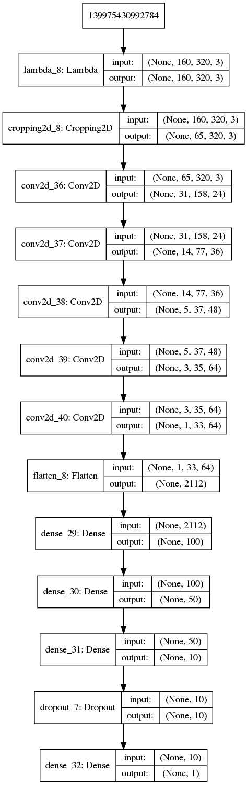

> 3.  Creation of the Training Set & Training Process

To capture good driving behavior, I first recorded four laps on track one. On the first three laps, I drive the vehicle as close as possible to the center lane. Here is an example image of center lane driving:

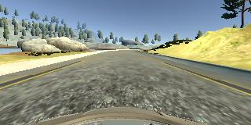

On the fourth lap, I recorded the vehicle recovering from the left side and right sides of the road back to center so that the vehicle would learn how to get back to the center of theroad. This gif image shows what a recovery looks like starting from center and getting back to center:

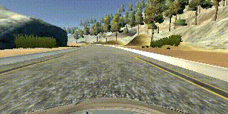

The first 3 laps (centered driving) were recorded and save separated from the last lap (recovering). After the collection process, there are 5193 data points (samples). 

I decided to use the 3 images from the Center, Left and Right camera of each sample. I added a `steering_correction` value to the steering angle of each corresponding image (the Center image has a correction value of `0`). The side camera's images could be interpreted as the central image of a car that isn't in the center of the lane, so that is why I need to add a correction value to the recorded steering angle because it will stimulate the car to drive back to the center when it gets to that position. These are examples of the Left, Center and Right camera output for the same sample set.

| Left | Center | Right |
|------|--------|-------|
|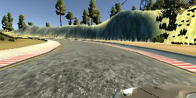 | 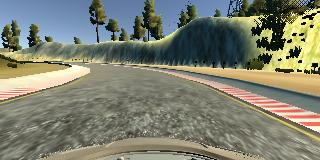 | 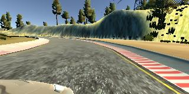|
| steering_correction = 0.2 | steering_correction = 0 | steering_correction = -0.2 |

To augment the dataset, I flipped the images and steering angles of each sample image (center, left and right). This would duplicate the dataset, and also add more data of right turns to help model don't bias to left and the result would be reasonable, the same as if we have recorded this driving on a horizontally flipped track. For example, here is an image and the corresponding augmented one:

| Normal | Augmented (Flipped) |
|------|--------|
|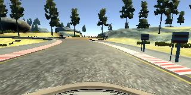 | 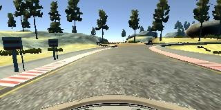 |

The dataset expansion process is done before training. When the code load the recorded data, it will add to the sample dataset the six possible data from that recorded line in the .csv file, with the following format: [`image_path`,`steer_angle_corrected`,`augmented_flag`]

- `image_path`: 3 possibilities -  Center[0], Left[1] and Right[2]
- `steer_angle_corrected`: the measured steering angle plus the respective steering_correction, accordingly to the current image (center, left or right)
- `augmented_flag`: A boolean flag to indicate when this image have to be flipped or not (this flag will be used in the generator)

This samples dataset is randomly shuffled and split in 80% for the `train_samples` set and 20% for the `validation_samples` set

At this point, each sample data will generate 6 images/measurements, resulting in a training dataset with size of `24926` and validation dataset with size of `6232`.

Here is the histogram of the steering angles in each dataset:

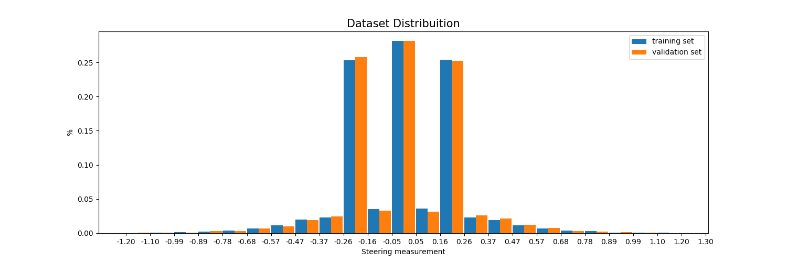

The histogram helps to check if training and validation dataset have similar distributions.

The generator function, which is responsible to read the images and augment the image/steering_angle when `augmented_flag` is set, returning them in batches. Using a generator to load and process the images avoids the program having to use a high amount of memory at once.

The images are pre processed directly in the Keras sequential model. The images are normalized from -0.5 to 0.5 through a lambda function and then cropped from top and bottom through Keras Cropping2D function to crop image on the lane area.

I used the training data for training the model. The validation set helped determine if the model was over or under fitting. The ideal number of epochs was `4` as evidenced by the following graph, showing that at this point both curves get closer and stable before overfitting again.

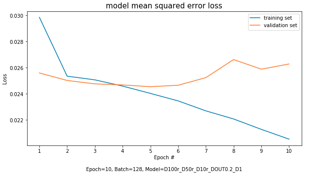

When training the model again (running the whole model.py script) with lower epochs, this is the result of the new trained model:

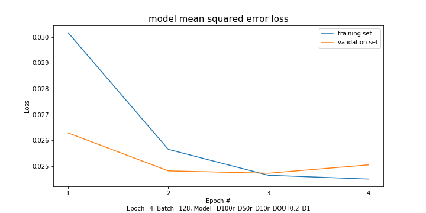

I used an adam optimizer so that manually training the learning rate wasn't necessary.